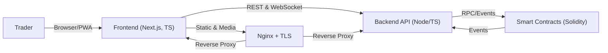

# ChainFlow ⛓️ — Fully On-Chain, Trustless Prop Trading Platform

A decentralized, transparent, and automated prop firm engineered for the future of trading. ChainFlow unites a fully on-chain evaluation and risk engine with a production-grade application stack for onboarding, KYC, trading UX, analytics, and operations.

**Live Dashboard:** **[https://dashboard.paxeer.app](https://dashboard.paxeer.app)**

> Our vision is to build provably fair, trustless trading infrastructure that removes human bottlenecks. We put prop trading rules on-chain, making them open, immutable, and auditable by anyone, delivering instant access and payouts with no opaque processes or centralized gatekeepers.

-----

## 📋 Table of Contents

  - [✨ Why It's Revolutionary](https://www.google.com/search?q=%23-why-its-revolutionary)
  - [🎯 Unique Selling Points](https://www.google.com/search?q=%23-unique-selling-points)
  - [🏗️ High-Level Architecture](https://www.google.com/search?q=%23%EF%B8%8F-high-level-architecture)
  - [🔧 Technology Stack](https://www.google.com/search?q=%23-technology-stack)
  - [🚀 Core Features](https://www.google.com/search?q=%23-core-features)
  - [⚙️ Getting Started (Development)](https://www.google.com/search?q=%23%EF%B8%8F-getting-started-development)
  - [🔌 API Highlights](https://www.google.com/search?q=%23-api-highlights)
  - [🛡️ Security & Compliance](https://www.google.com/search?q=%23%EF%B8%8F-security--compliance)
  - [🗺️ Roadmap](https://www.google.com/search?q=%23%EF%B8%8F-roadmap)
  - [📜 License](https://www.google.com/search?q=%23-license)

-----

## ✨ Why It's Revolutionary

ChainFlow is not just another trading platform; it's a paradigm shift. By enforcing all prop firm rules in smart contracts, we eliminate the need for trust in centralized operators.

  - **Eliminates Centralized Trust**: All evaluation, risk gating, and profit distribution are automated with zero manual intervention. No more ad-hoc exceptions or opaque processes.
  - **Radical Transparency**: The rules are the same for everyone—open, immutable, and verifiable on the blockchain. No favoritism or hidden levers.
  - **Automated & Scalable**: Deterministic on-chain logic allows the platform to support an unlimited number of traders with instant access and payouts.

-----

## 🎯 Unique Selling Points

  - 💯 **100% On-Chain**: No centralized dependencies for core trading logic.
  - 🤝 **Trustless**: Smart contracts are the ultimate arbiter of all rules.
  - 🔍 **Transparent**: Every action and transaction is verifiable on-chain.
  - 🤖 **Automated**: No manual intervention is needed for evaluation or payouts.
  - 🔒 **Secure**: Multi-layer on-chain and off-chain risk management.
  - 📈 **Scalable**: Built from the ground up to support unlimited traders.
  - ⚖️ **Fair**: The same immutable rules apply to everyone.

-----

## 🏗️ High-Level Architecture

Our system is divided into three distinct layers: the on-chain protocol, the off-chain application, and the supporting infrastructure. This separation ensures security, scalability, and a seamless user experience.



  - **Protocol Layer (Solidity)**: Contains the immutable business logic, evaluation rules, payout mechanisms, and a complete audit trail via events. It is the single source of truth.
  - **Application Layer (Next.js + Node/TS)**: Provides a polished user experience for onboarding, KYC, portfolio management, trading, analytics, and support. It is non-custodial by design.
  - **Infrastructure Layer (Nginx, PM2, Certbot)**: A robust stack providing a secure, performant, and reliable service with TLS termination, process management, and automated SSL renewals.

-----

## 🔧 Technology Stack

| Layer       | Technology                                                              |
| :---------- | :---------------------------------------------------------------------- |
| **Protocol** | `Solidity`, `OpenZeppelin`, `Hardhat`                                   |
| **Frontend** | `Next.js`, `TypeScript`, `React`, `shadcn/ui`, `PWA`                    |
| **Backend** | `Node.js`, `TypeScript`, `Express`, `Sequelize`, `WebSockets`           |
| **Database** | `PostgreSQL` (via Sequelize)                                            |
| **Infra** | `Nginx` (Reverse Proxy), `PM2` (Process Manager), `Certbot` (SSL)       |
| **Tooling** | `pnpm` (Monorepo), `Swagger` (API Docs), `ESLint`, `Prettier`           |

-----

## 🚀 Core Features

### Protocol Layer (Solidity)

  - **On-Chain Evaluation System**: All performance metrics and rules are calculated and enforced by smart contracts.
  - **Automated Risk Management**: Smart contracts automatically gate risky trades and enforce drawdown limits.
  - **Instant Profit Distribution**: Payouts are triggered automatically upon successful evaluation, with no withdrawal delays.
  - **Modular & Secure Design**: Utilizes Factory and Registry patterns, role-based access control (OpenZeppelin), and a pausable emergency-stop capability.
  - **Comprehensive Events**: A full on-chain audit trail for maximum transparency.

### Application & Admin Layer

  - **Modern Trading UX**: Feature-rich interface with Limit & Market order forms, real-time market data via WebSockets, and comprehensive portfolio/history views.
  - **Seamless Onboarding**: Integrated KYC flows with progress visualization and step-wise gating.
  - **Public Announcements**: A dedicated API and dashboard panel to keep users informed.
  - **Mandatory Beta Disclaimer**: Enforced at registration to ensure user awareness.
  - **Extensive Admin UI**: A powerful back-office for managing:
      - **CRM**: Users, Roles, KYC Applications, Support Tickets.
      - **Finance**: Fiat/Crypto Gateways, Deposits, Withdrawals, Wallets, Transactions.
      - **Trading Extensions**: Futures, Forex, Staking, ICOs, P2P Markets.
      - **System**: Settings, Announcements, Cron Jobs, Logs, and more.

-----

## ⚙️ Getting Started (Development)

Follow these steps to set up the development environment locally.

### 1\. Prerequisites

  - [Node.js](https://nodejs.org/) (v22.x recommended)
  - [pnpm](https://pnpm.io/)
  - [Nginx](https://www.nginx.com/)
  - A `.env` file at the repository root (`/home/.env` in production) with the necessary secrets.

### 2\. Installation

Clone the repository and install dependencies using `pnpm`.

```bash
git clone <repository_url>
cd <repository_name>
pnpm install
```

### 3\. Running the Backend

Build the TypeScript source and start the server with PM2.

```bash
# Build the backend
pnpm -w --filter backend build

# Start with PM2
pm2 start backend/dist/index.js --name backend --interpreter "$(nvm which 22)" --env production
```

### 4\. Running the Frontend

Build the Next.js app and start the server with PM2.

```bash
# Build the frontend
pnpm -w --filter frontend build

# Start with PM2 using the production config
pm2 start production.config.js --env production frontend
```

### 5\. Configuring Nginx

Configure Nginx as a reverse proxy. Create a config file at `/etc/nginx/sites-available/dashboard.paxeer.app.conf` and then enable it.

```bash
# Enable the site by creating a symlink
sudo ln -sf /etc/nginx/sites-available/dashboard.paxeer.app.conf /etc/nginx/sites-enabled/

# Test the configuration and reload Nginx
sudo nginx -t && sudo systemctl reload nginx
```

-----

## 🔌 API Highlights

The backend exposes a well-structured, typed API with real-time WebSocket streams.

> **Swagger Docs**: The full OpenAPI specification is available at `/api/docs/swagger.json`.

  - **Public**: `GET /api/public/announcements`, `GET /api/settings`
  - **User**: `GET /api/user/kyc/level`, `POST /api/user/kyc/application`, Profile, Notifications, OTP
  - **Finance**: Deposits (Stripe, Adyen, etc.), Withdrawals, Wallets, Transactions
  - **Trading**: Real-time market, ticker, and order data via WebSockets and REST endpoints.
  - **Admin**: Comprehensive endpoints for managing all aspects of the platform, from users and KYC to system settings and cron jobs.

-----

## 🛡️ Security & Compliance

Security is our top priority. The platform is designed with a multi-layered approach to protect users and capital.

  - **Non-Custodial Logic**: The backend application cannot override on-chain protocol outcomes.
  - **End-to-End Encryption**: Full TLS termination at the Nginx reverse proxy with automated Certbot renewals.
  - **Fine-Grained Access Control**: Granular permission strings are enforced across all admin routes.
  - **Robust Validation**: Strong input validation and Sequelize model constraints prevent common vulnerabilities.
  - **Best Practices**: Includes mitigations for CSRF/XSS, soft deletes (`paranoid`), and comprehensive logging.

### Recommendations for Mainnet

  - ✅ Commission a professional third-party audit of the protocol and application.
  - 🐞 Launch a public bug bounty program.
  - 📈 Implement a progressive rollout plan with initial capital limits.
  - 📊 Establish an active monitoring and incident response plan.

-----

## 🗺️ Roadmap

  - [ ] Persist Beta acceptance across user sessions and devices.
  - [ ] Implement real-time announcements via WebSockets.
  - [ ] Develop public, on-chain metrics dashboards (e.g., evaluation success rate, total payouts).
  - [ ] Introduce fuzzing and property-based testing for protocol and app layers.
  - [ ] Complete professional security audit and launch bug bounty program.
  - [ ] Implement further gas optimizations based on mainnet usage data.

-----

## 📜 License

Copyright © ChainFlow

*Licensing terms to be finalized prior to general availability.*

\<p align="center"\>
Built with ❤️ for the future of decentralized finance.
\</p\>
